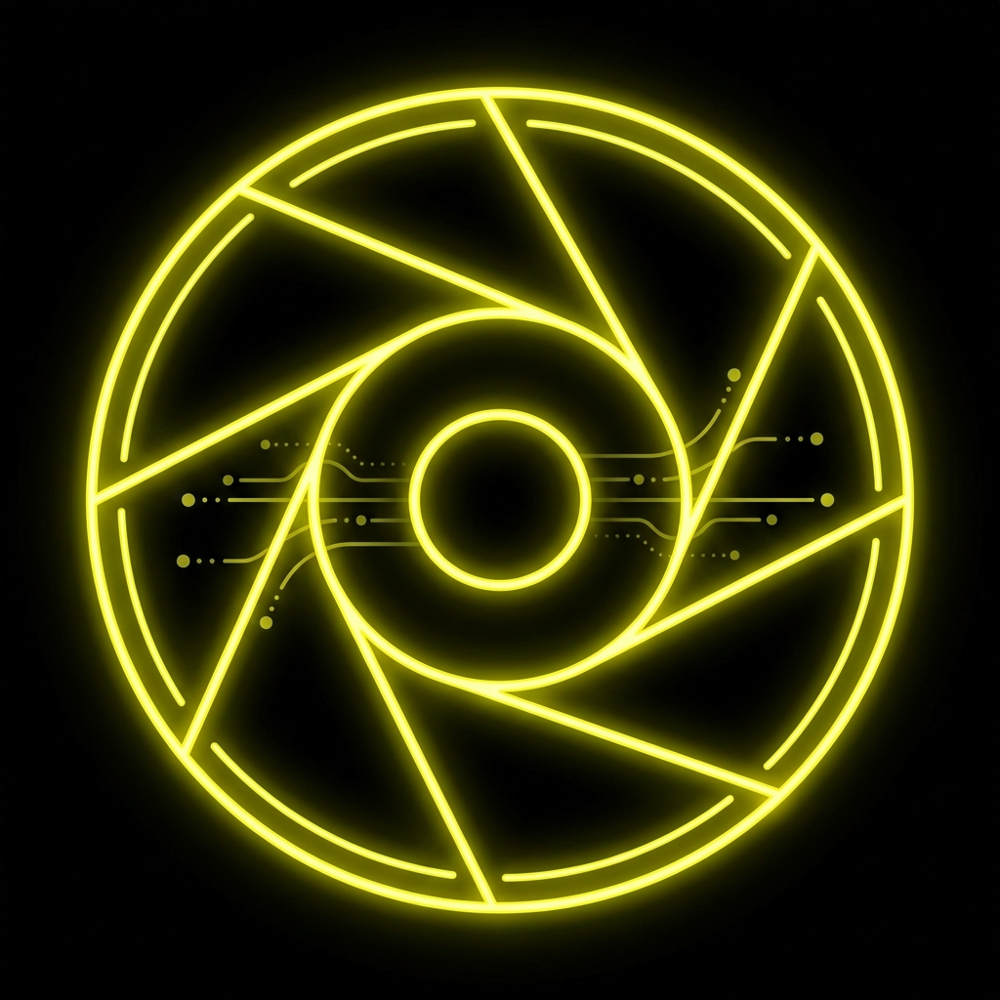

# Lake + L-Acoustics + Smaart Stream Deck Plugin

A Stream Deck+ plugin that connects to Lake LM modules, L-Acoustics P1/LC16D devices, and the Smaart API to provide fast control of mute, level, preset recall, and measurement utilities from Stream Deck keys and dials.


## Screenshots

The plugin ships with a set of action icons that appear on Stream Deck keys and dials:

| Action | Icon |
| --- | --- |
| Level + Press-to-Mute (Dial) |  |
| Preset Recall |  |
| Mute |  |
| Smaart Generator |  |
| Smaart Capture |  |
| Smaart Compute Delay |  |
| Smaart Toggle Trace |  |

## Features

- Control Lake LM module/group gain and mute with Stream Deck+ encoders.
- Toggle mute on Lake LM modules/groups and L-Acoustics outputs.
- Recall Lake and L-Acoustics presets/configurations from keys.
- Trigger Smaart generator, capture, delay calculation, and active trace visibility actions.

## Configuration

Default discovery settings (overridable in Stream Deck global settings):

- Lake Controller host: `192.168.0.10` on port `1024`
- L-Acoustics discovery subnet: `192.168.0.0/24`
- Optional explicit L-Acoustics hosts: `192.168.0.20,192.168.0.21`
- Smaart host: `127.0.0.1` on port `26000`

## Repository layout

```
.
├── com.jvhtec.lake-smaart.sdPlugin
│   ├── images            # Stream Deck icons and indicators
│   ├── layouts           # Dial layouts
│   ├── plugin            # TypeScript runtime
│   └── ui                # Property inspector HTML/JS
├── docs                  # Documentation and external references
└── package.json          # Build scripts
```

## Documentation

- [User manual](docs/USER_MANUAL.md)
- [L-Acoustics HTTP API notes](docs/lacoustics-http-api.md)
- [Multi-device Stream Deck+ specification](docs/streamdeck-multi-device-spec.md)
- [Stream Deck SDK reference](docs/streamdeck-api.md)
- [Lake Controller reference](docs/lake-controller-api.md)
- [Smaart suite reference](docs/smaart-suite-api.md)

## Build & install

1. Install dependencies: `npm install`
2. Build the plugin: `npm run build`
3. Copy `com.jvhtec.lake-smaart.sdPlugin` into your Stream Deck plugins folder.
