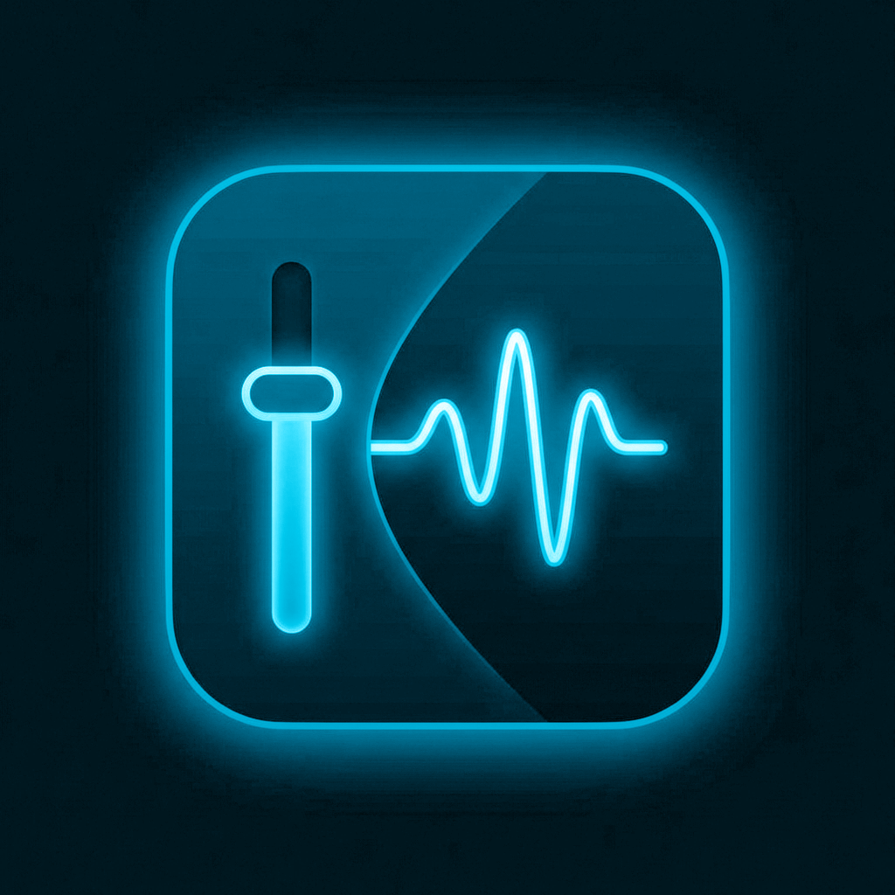
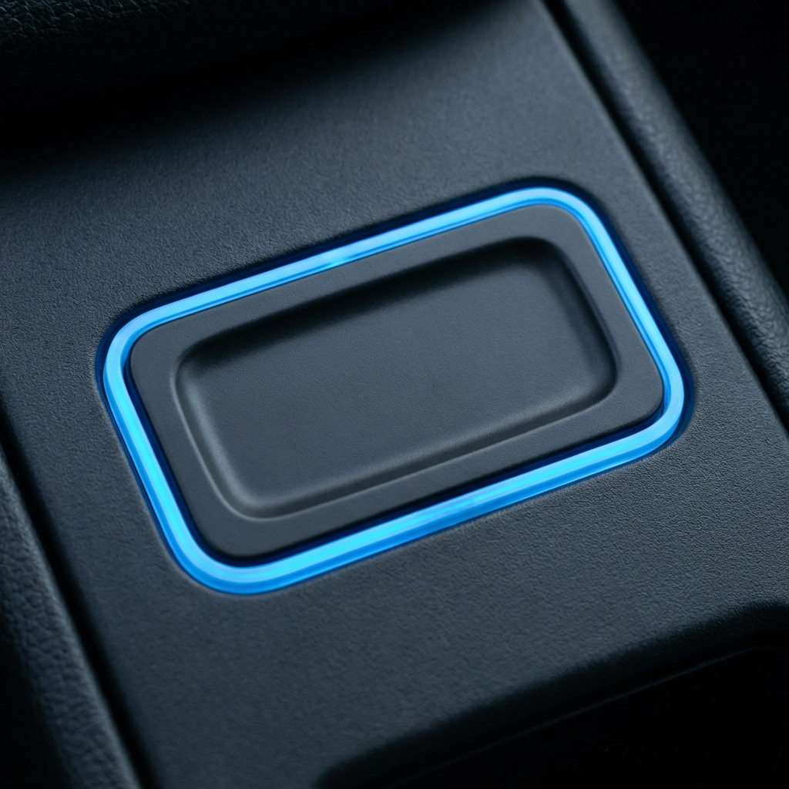

# Lake + L-Acoustics + Smaart Stream Deck Plugin

A Stream Deck+ plugin that connects to Lake LM modules, L-Acoustics P1/LC16D devices, and the Smaart API to provide fast control of mute, level, preset recall, and measurement utilities from Stream Deck keys and dials.



## Screenshots

The plugin ships with a set of action icons that appear on Stream Deck keys and dials:

| Action | Icon |
| --- | --- |
| Level + Press-to-Mute (Dial) |  |
| Preset Recall |  |
| Mute |  |
| Smaart Generator Gain (Dial) |  |
| Smaart Generator |  |
| Smaart SPL Meter |  |
| Smaart Capture |  |
| Smaart Compute Delay |  |
| Smaart Toggle Trace |  |

## Features

- Control Lake LM module/group gain and mute with Stream Deck+ encoders.
- Toggle mute on Lake LM modules/groups and L-Acoustics outputs.
- Recall Lake and L-Acoustics presets/configurations from keys.
- Adjust Smaart generator gain from a dial and press the dial to toggle the generator on or off.
- Display live Smaart SPL values on a key with inspector-based input and metric selection.
- Trigger Smaart generator and measurement-focused actions for the currently active Smaart measurement.

## Configuration

Default discovery settings (overridable in Stream Deck global settings):

- Lake device filter: optional device IP or frame ID, for example `169.254.23.45` or `3d000011:d6ed9201`
- Lake port: `6016` by default for dynamic response mode
- Lake adapter IP: optional local NIC address to bind on the Lake network when multiple adapters are active
- Lake debug log: optional verbose DLM logging to the Stream Deck log
- L-Acoustics discovery subnet: `192.168.1.0/24`
- Optional explicit L-Acoustics hosts: `192.168.1.20,192.168.1.21`
- Smaart host: `127.0.0.1` on port `26000`

Lake DLM port notes:
- Default mode is dynamic response mode on destination port `6016`, which allows the plugin to use an ephemeral local UDP port.
- Fixed response mode uses destination port `6015` and reserves local UDP port `6004`.
- If Lake Controller is running on the same computer, avoid fixed mode because Lake Controller also requires local UDP port `6004`.

## Repository layout

```
.
├── com.jvhtec.lake-smaart.sdPlugin
│   ├── images            # Stream Deck icons and indicators
│   ├── layouts           # Dial layouts
│   ├── plugin            # TypeScript runtime
│   └── ui                # Property inspector HTML/JS
├── docs                  # Documentation and external references
└── package.json          # Build scripts
```


## Property inspector compatibility

- Action inspector pages (`ui/key.html` and `ui/dial.html`) are intentionally self-contained (inline script and styles) to avoid load failures on systems where the Stream Deck plugin install path includes special characters such as `#` (for example, user profiles like `FoH #1`).
- **Fallback web inspector**: When the plugin detects `#` or `?` in its installation path (which breaks `file://` URL loading in Stream Deck's embedded browser), it automatically starts a local HTTP server and opens a web-based Property Inspector in the user's default browser. This fallback provides the same configuration UI and communicates with Stream Deck through the plugin backend's WebSocket relay.

## Documentation

- [User manual](docs/USER_MANUAL.md)
- [L-Acoustics HTTP API notes](docs/lacoustics-http-api.md)
- [L-Acoustics testing guide](docs/lacoustics-testing.md)
- [Lake debugging notes](docs/lake-debugging.md)
- [Lake DLM protocol notes](docs/lake-dlm-protocol-v3_4.md)
- [Multi-device Stream Deck+ specification](docs/streamdeck-multi-device-spec.md)
- [Stream Deck SDK reference](docs/streamdeck-api.md)
- [Lake Controller reference](docs/lake-controller-api.md)
- [Smaart suite reference](docs/smaart-suite-api.md)

## Build & install

1. Install dependencies: `npm install`
2. Build the plugin: `npm run build`
3. Copy `com.jvhtec.lake-smaart.sdPlugin` into your Stream Deck plugins folder.

`npm run build` also stages the runtime `ws` dependency inside `com.jvhtec.lake-smaart.sdPlugin/node_modules` so the copied plugin bundle can start outside the repo.

For local Lake debugging without hardware, run `npm run lake:mock` and point the plugin to `127.0.0.1:6016`. For an automated codec and command-path check, run `npm run lake:selftest`.

## L-Acoustics verification

- Start the local L-Acoustics mock server: `npm run la:mock -- --port 18080`
- Run the read-only smoke pass: `npm run la:smoke -- --host 127.0.0.1:18080`
- Run the automated LA regression suite: `npm run test:la`

Add `--write-checks` to `npm run la:smoke -- --host <host>` when you explicitly want mute, gain, and preset recall writes exercised. For Monday hardware sessions, enable **LA Debug Log** in the property inspector first so Stream Deck logs include per-request path/status traces.
